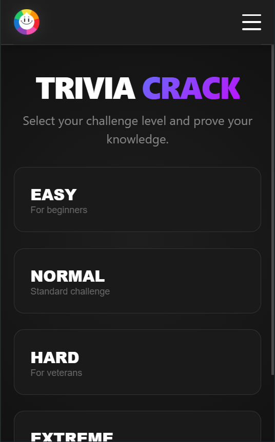

# 🧠 Trivia Crack - TFI UI Construction


Este proyecto es un videojuego de preguntas y respuestas (SPA) desarrollado como **Trabajo Final Integrador** para la materia **Construcción de Interfaces de Usuario** en la Universidad Nacional de Quilmes (UNQ).

El objetivo fue crear una experiencia de usuario fluida, responsive y moderna, consumiendo una API externa en tiempo real y gestionando estados complejos de juego.

## 📸 Capturas de Pantalla

| Desktop Home | Mobile Game |
|:---:|:---:|
|  |  |

> *Nota: Las capturas se encuentran en la carpeta `/screenshots`.*

## ✨ Características Principales

* **🎮 Modos de Juego:** 4 niveles de dificultad (Easy, Normal, Hard, Extreme).
* **⏱️ Time Challenge:** Sistema de temporizador con barra de progreso visual (10s por pregunta).
* **📡 API Integration:** Consumo de preguntas en tiempo real mediante `Axios`.
* **💾 Persistencia de Datos:** Guardado de *High Scores* en LocalStorage del navegador.
* **📱 Diseño Responsive:** Interfaz adaptativa "Mobile First" con menú hamburguesa y layouts flexibles.
* **🎨 UI/UX Gaming:** Estética oscura, feedback visual inmediato (acierto/error) y micro-interacciones.

## 🛠️ Stack Tecnológico

* **Core:** React.js (Hooks: useState, useEffect).
* **Build Tool:** Vite.
* **Enrutado:** React Router DOM v6.
* **Peticiones HTTP:** Axios.
* **Estilos:** CSS3 nativo (Grid & Flexbox) con arquitectura modular.

## 🚀 Instalación y Ejecución

Sigue estos pasos para descargar y ejecutar el proyecto en tu entorno local.

### 1. Prerrequisitos

Asegúrate de tener instalado:

* [Node.js](https://nodejs.org/) (v14 o superior recomendada).
* [Git](https://git-scm.com/).

### 2. Descargar el Proyecto

Abre tu terminal y clona el repositorio:

```bash
git clone https://github.com/Bertolini-Victor/unq-ui-victor-hugo-bertolini-agaras-trabajo-final.git
```

### 3. Instalar Dependencias

Instala las librerías necesarias ejecutando:

```bash
npm install
```

### 4. Ejecutar Localmente

Levanta el servidor de desarrollo:

```bash
npm run dev
```

Una vez ejecutado, verás en la consola una URL (generalmente http://localhost:5173/). Ábrela en tu navegador para empezar a jugar.

## 📂 Estructura del Proyecto

El código está organizado siguiendo buenas prácticas de separación de responsabilidades:

```Bash
src/
├── components/      # Componentes reutilizables (Navbar, etc.)
├── pages/           # Vistas principales (Home, Game, About)
│   ├── game/        # Lógica y estilos del juego
│   ├── home/        # Landing page
│   └── about/       # Información del proyecto
├── services/        # Lógica de negocio externa
│   ├── api.js       # Llamadas a Axios
│   └── storage.js   # Manejo de LocalStorage
├── App.jsx          # Componente raíz
└── main.jsx         # Punto de entrada
```

## 👥 Autor

Victor H. Bertolini Agaras - Desarrollador Full Stack en formación

* [Universidad Nacional de Quilmes (UNQ)](https://www.unq.edu.ar/)
